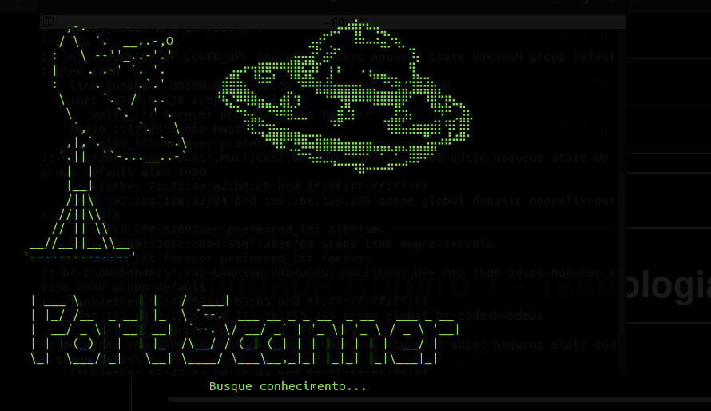
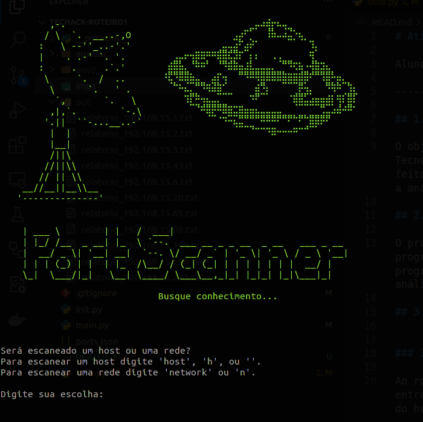
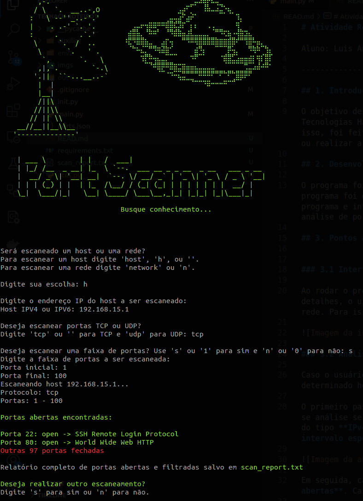
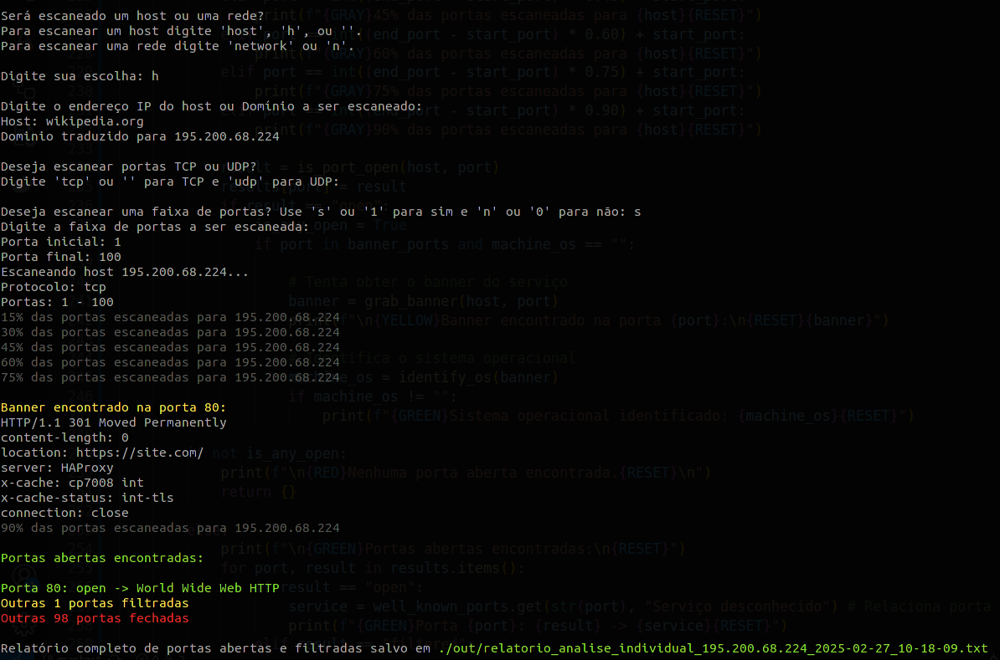
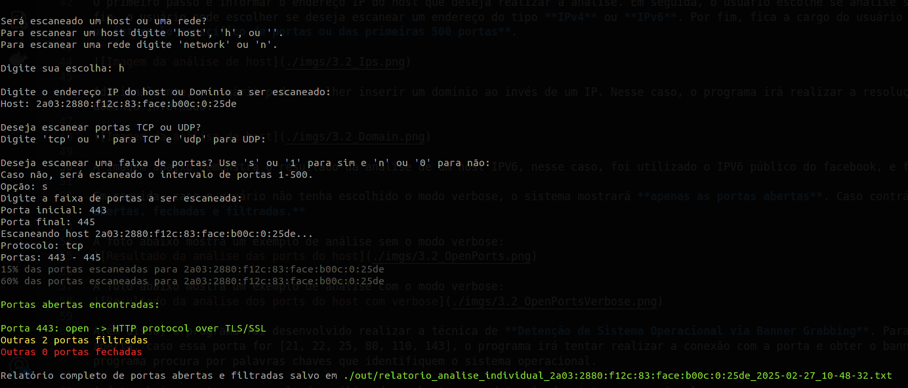
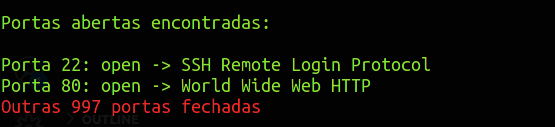
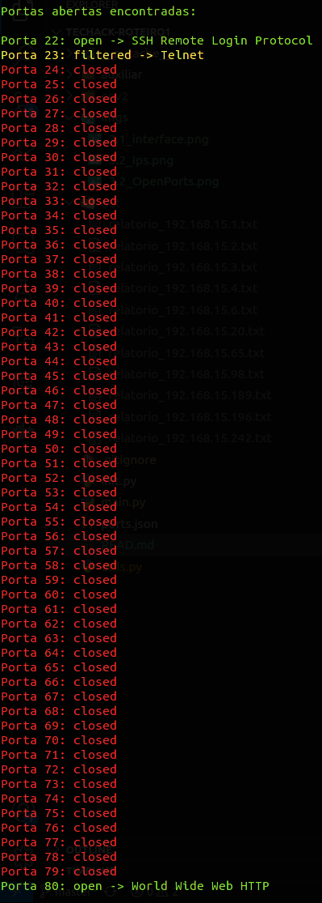
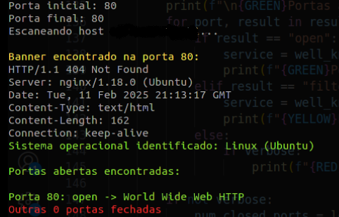
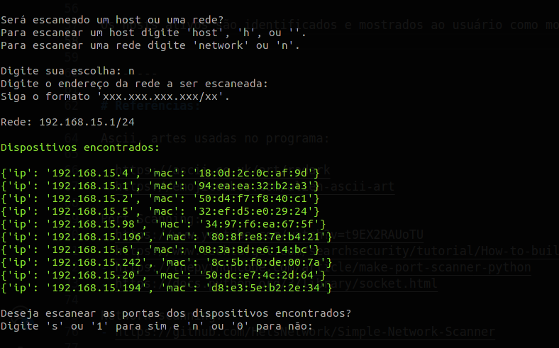

# Atividade Roteiro 1 - Tecnologias Hacker

Aluno: Luis Antonio Santana Rodrigues

--------------------------------------------------

--------------------------------------------------

## 1. Introdução

O objetivo deste roteiro é apresentar o trabalho desenvolvido pelo aluno no roteiro 1 da disciplina de Tecnologias Hacker. O trabalho consiste em desenvolver uma ferramenta similar ao nmap, estudado em sala. Para isso, foi feito um programa em Python capaz de realizar a análise de portas de um determinado host ou realizar a análise da rede em que está inserido e identificar os hosts ativos.

## 2. Desenvolvimento

O programa foi desenvolvido em Python e utiliza a biblioteca Socket para realizar a conexão com os hosts. O programa foi dividido em duas partes, a primeira é o arquivo **main.py** que é responsável por iniciar o programa e realizar as primeiras interações com o usuário, a segunda parte é o arquivo **utils.py**, o qual contém toda a lógica de análise de portas e rede

## 3. Pontos abordados:

### 3.1 Interface com o usuário

Lembre-se de criar um ambiente virtual e instalar as dependências do projeto. Para isso, execute os seguintes comandos em sistemas operacionais Linux:

- `python3 -m venv env`

- `source ./env/bin/activate`

- `pip install -r requirements.txt`

Para rodar o programa execute uma dessas instruções:

- `python main.py`
 
- `python main.py -v` ->  para rodar como verbose e obter mais detalhes

O usuário é apresentado a uma interface, onde pode escolher entre analisar um host ou analisar a rede. Para isso, o usuário deve escolher a opção desejada e informar o IP do host ou da rede.

### 3.2 Análise de Host

Caso o usuário escolha a opção de análise de host, o programa irá realizar o escaneamento das portas de um determinado host informado. 

O primeiro passo é informar o endereço IP do host que deseja realizar a análise. Em seguida, o usuário escolhe se análise será feita com protocolo TCP ou UDP. No fim, o usuário pode escolher se deseja escanear um endereço do tipo **IPv4** ou **IPv6**. Por fim, fica a cargo do usuário se **deseja realizar o escaneamento de um intervalo específico de portas ou das primeiras 500 portas**. 

Adicionalmente, o usuário pode escolher inserir um domínio ao invés de um IP. Nesse caso, o programa irá realizar a resolução de DNS e tentará obter o IP do domínio informado.

A imagem abaixo demonstra o resultado da análise de um host IPV6, nesse caso, foi utilizado o IPV6 público do facebook, e foi analisado apenas as portas de 443 a 445.

Em seguida, caso o usuário não tenha escolhido o modo verbose, o sistema mostrará **apenas as portas abertas**. Caso contrário, o sistema **mostrará as portas abertas, fechadas e filtradas.**

A foto abaixo mostra um exemplo de análise sem o modo verbose:

A foto abaixo mostra um exemplo de análise com o modo verbose:

Além disso, o programa foi desenvolvido realizar a técnica de **Detenção de Sistema Operacional via Banner Grabbing**. Para isso, ao detectar que há uma porta aberta, caso essa porta for [21, 22, 25, 80, 110, 143], o programa irá tentar realizar a conexão com a porta e obter o banner do serviço. Ao obter o banner, o programa procura por palavras chaves que identifiquem o sistema operacional.

A foto abaixo mostra um exemplo de análise de um host com a detecção de sistema operacional:

O resultado da análise de portas é salvo na pasta **./out/** em um arquivo: **relatorio_analise_individual_host.txt**.

### 3.3 Análise de Rede

**Observação**: Para realizar a análise de rede, é necessário que o usuário tenha permissão de administrador. Em linux rodar o programa com o comando `sudo bash -c "source ./env2/bin/activate && python3 main.py"`.

Caso o usuário escolha a opção de análise de rede, o programa irá realizar o escaneamento de todos os hosts ativos na rede em que o host está inserido. Para isso, o programa faz uso da técnica de **ARP Scanning**. Essa técnica consiste em enviar pacotes ARP (Address Resolution Protocol) para todos os endereços IP possíveis dentro de um intervalo de rede. Quando um host ativo recebe o pacote, ele responde com seu endereço MAC, permitindo assim a identificação dos dispositivos conectados.

Os hosts ativos são identificados e mostrados ao usuário como mostra a imagem abaixo:

Caso o usuário deseje, ele pode realizar a análise das 1000 primeiras portas dos hosts ativos. Para isso, o programa irá realizar a análise por protocolo TCP de portas de cada host exibido na lista e mostrará as portas abertas.

Esse processo pode demorar um pouco, pois o programa irá realizar a análise de todas as portas de cada host ativo.

O resultado individual de cada host mostrado acima é salvo na pasta **./out/** em um arquivo com o nome do host.

---

# Para o professor corretor:

Boa tarde professor, o código acima implementou:

- Deverá possuir uma interface amigável e de fácil utilização (user-friendly interface); (1
ponto)

- Permitir o escaneamento de um host ou uma rede; (1 ponto)

- Permitir inserir o range (intervalo) de portas a serem escaneadas; (1 ponto)

- Além da função de escaneamento, espera-se que seu código relacione as portas Well-
Know Ports e seus serviços, e apresente em sua saída (imprimir) o número da porta e
o nome do serviço associado. (2 pontos)

- Detecção do estado das portas (1 ponto)

- Opção de escaneamento UDP (2 pontos)

- Detecção do sistema operacional via banner grabbing (2 pontos)

- Suporte a IPv6 (2 pontos)

Ou seja, todos os adicionais foram implementados, de modo que a nota do relatório almejada foi de 12 pontos, limitada a 10 pontos.

--------

# Referências:

Ascii, artes usadas no programa:

- https://ascii.co.uk/art/radark
- https://emojicombos.com/alien-ascii-art

Port Scanning:
- https://www.youtube.com/watch?v=t9EX2RAUoTU
- https://www.techtarget.com/searchsecurity/tutorial/How-to-build-a-Python-port-scanner
- https://thepythoncode.com/article/make-port-scanner-python
- https://docs.python.org/3/library/socket.html

Network scanning:
- https://github.com/HelsNetwork/Simple-Network-Scanner

Banner Grabbing:
- https://github.com/Beek-Kefyalew/Python-Banner-Grabber/blob/master/bannerGrab.py
- https://johanneskinzig.de/index.php/it-security/12-port-scanning-and-banner-grabbing-with-python

UDP Scanning:
- https://wiki.python.org/moin/UdpCommunication
- https://docs.python.org/3/library/socket.html

IPV6
- https://www.geeksforgeeks.org/python-simple-port-scanner-with-sockets/

Well-Know Ports:
- https://github.com/maraisr/ports-list/blob/main/tcp.csv
